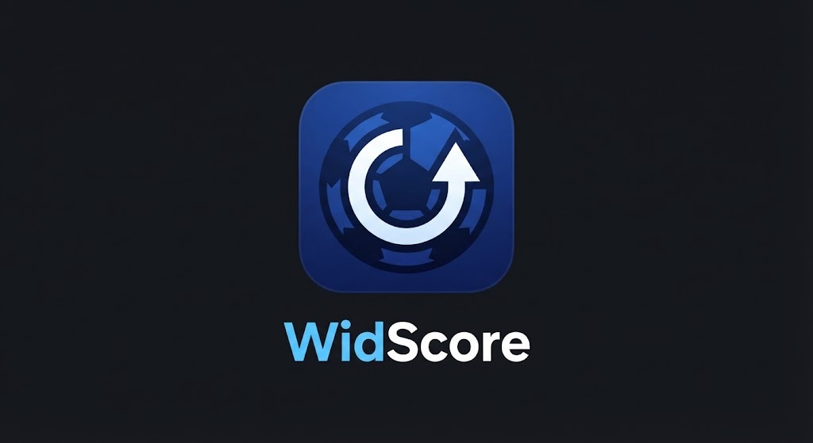
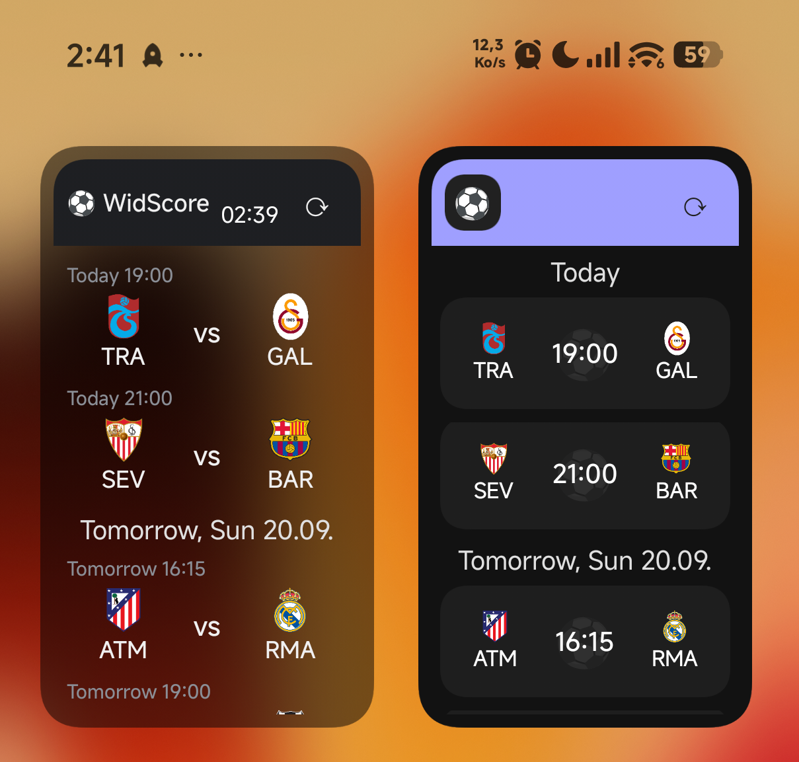

# WidScore

*In English? See [README.md](README.md).*

Les scores foot sur l'écran d'accueil : 2 widgets (Classic + Dark), live, à venir, terminés récents. Sans compte, sans pub.

## Pourquoi ?

Le nouveau widget SofaScore est moche, lourd et pas flexible — taille imposée, contenu imposé, mes équipes noyées dans le bruit. Alors j'ai fait le mien : que mes équipes, mon layout, mes tailles. Rien d'autre.

## Installation

1. Va sur la page [**Releases**](https://github.com/Walkoud/WidScore/releases), télécharge le dernier `WidScore-vX.Y.Z.apk`.
2. Ouvre le fichier sur ton téléphone, autorise l'installation, installe.
3. Ajoute le widget : appui long sur l'écran d'accueil → **Widgets** → **WidScore** (Classic ou Dark).

## Démarrage en 3 étapes

1. **Ouvre l'app** → onglet Teams, cherche tes équipes (ex. `Galatasaray`, `Real Madrid`) et coche-les en favoris.
2. **Pas besoin de cocher les ligues** : une équipe suivie amène automatiquement toutes ses compétitions (championnat + coupes d'Europe...).
3. **Tape ⟳ une seule fois et attends ~1 minute** : le premier chargement va chercher les calendriers, les suivants sont quasi instantanés (cache).

## Les sources : laquelle activer ?

| Source | Clé ? | Couverture | À savoir |
|---|---|---|---|
| **ESPN** | Non, marche direct | Live + 3 mois d'à-venir + terminés | Suffit dans 90 % des cas |
| **football-data.org** | Oui, gratuite ([inscription](https://www.football-data.org/client/register)) | Saison complète des top ligues | 10 appels/min, **pas de Süper Lig** |
| **bzzoiro** | Oui ([inscription](https://sports.bzzoiro.com/)) | 88 ligues, passé + futur par équipe, **Süper Lig incluse** | Complément idéal d'ESPN |

Colle ta clé dans l'app (Settings), sauvegarde : les matchs arrivent au refresh suivant.

## À faire / à ne pas faire

**À faire :**
- Suivre des **équipes** plutôt que des ligues (plus précis, moins d'appels).
- Après un changement de favoris ou de clé : **un seul** appui sur ⟳, puis laisser finir.
- Les réglages d'apparence (taille, couleurs, position, mode compact) s'appliquent **instantanément**, sans recharger.
- Couper une source dont tu ne te sers plus : ses matchs disparaissent du widget aussitôt.

**À ne pas faire :**
- **Ne pas spammer le bouton ⟳** : les demandes sont fusionnées, mais chaque run complet prend 1 à 2 minutes. Taper 5 fois = attendre plus longtemps, pas moins.
- Ne pas vider le cache / réinstaller pour "forcer" : ça détruit les calendriers en cache (12 h pour les mois, 30 min pour les terminés) et tout est retéléchargé.
- Ne pas chercher un match d'il y a 3 jours : la rétention des terminés est réglable ("Keep finished"), à 0 les terminés sont masqués.
- Pas de panique si `FAIL http=-1` dans les logs : c'est le réseau du téléphone qui a flanché, l'app réessaie avec l'ancien cache en attendant.

## Dépannage rapide

- **Widget vide** : vérifie que tu as au moins une équipe ou ligue en favoris, puis ⟳ une fois et attends.
- **Un match manque** : vérifie qu'il est dans une compétition couverte (voir tableau), et que sa source est activée avec sa clé.
- **Scores pas à jour** : ⟳ une fois. L'auto-refresh tourne toutes les 15 min minimum (limite Android).
- **Voir ce qui se passe** : dans l'app, la carte sync + les logs montrent chaque appel (ligues OK, matchs affichés/masqués).

## Technique (pour les curieux)

- 100 % cloud : chaque push sur `main` compile l'APK via GitHub Actions, chaque tag `v*` publie une Release avec l'APK.
- Détails des APIs et du pipeline : voir [APIS.md](APIS.md).
